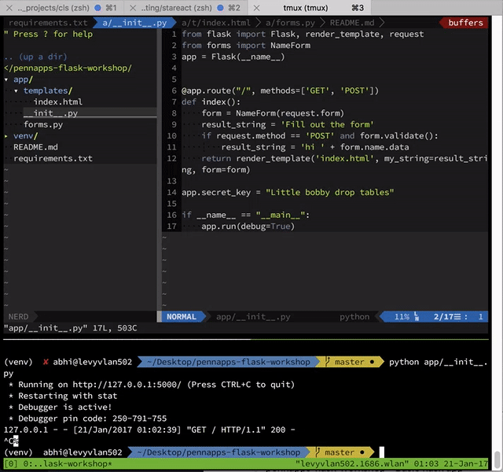

# PennApps XV Flask Workshop

### A really really simple 10 minute demo of routes, forms, and templates in flask.

* Uses Flask (of course) for serving routes
* Jinja for templating
* wtforms for forms

  

## How do I run this

If you haven't already, install `pip` and `virtualenv`. 

Run `virtualenv venv`

Run `source venv/bin/activate`

Run `pip install -r requirements.txt`

Run `python app/__init__.py` you can access the app at `http://localhost:5000`
